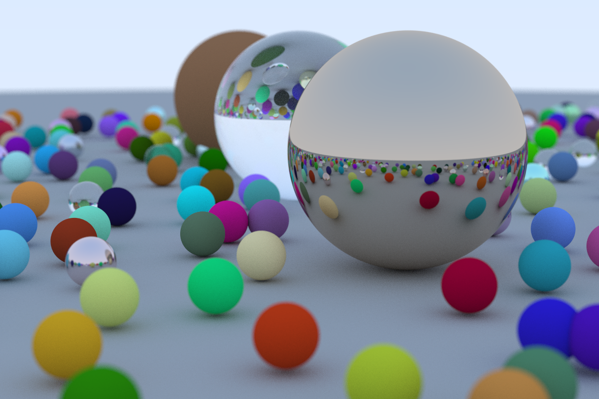

# Simple Lean4 Raytracing

My take on implementing a toy raytracer in Lean4 following [Ray Tracing in One Weekend](https://raytracing.github.io/books/RayTracingInOneWeekend.html) book by Peter Shirley. I am not the first one to implement such raytracer in Lean4, this has also been done [here](https://github.com/kmill/lean4-raytracer).

## Pictures

1200x800 resolution, 240 samples per pixel, max 30 bounces per ray, 70 mins on 6 threads on Intel(R) Core(TM) i7-6820HQ CPU @ 2.70GHz.